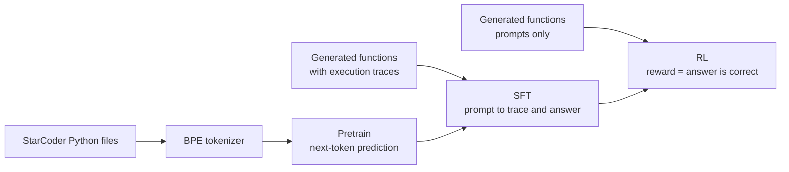

# asp

A language model built from scratch and trained through three stages on a single 16 GB GPU: pretraining on Python source, supervised fine-tuning to trace small programs step by step, and reinforcement learning with rewards checked by actually running the program.

Nothing here wraps a training framework. The attention kernel, the mixture-of-experts layer, the samplers, the generation loop with its KV cache, and the RL loop are all written in this repo, with tests.

> **Status:** the pipeline runs end to end and every stage is tested. A full-size run with pretraining has not been completed yet, so the headline results table below is empty. RL has been run on full-size models trained with SFT alone, on two tasks. It was stable on both and moved held-out accuracy by about a point at most on either.

## What it does

The model is asked what a generated Python function returns for given arguments. It writes out the executed lines with the values they produce, then the answer:

```
def f(a, b):
    a *= ((a * -1) * -2)
    b = (-2 * 8)
    a = a
    return a, b

# What does f(9, -3) return?

<|think|>a *= ((a * -1) * -2)  ->  a = 162
b = (-2 * 8)  ->  b = -16
a = a
return a, b<|/think|><|answer|>(162, -16)<|/answer|>
```

The functions are generated, not scraped, so the supply is unlimited and every answer can be verified by executing the code. That makes the task usable for both supervised learning (the trace is the target) and reinforcement learning (the reward is whether the answer is right). Three difficulty tiers go from straight-line arithmetic to nested loops over lists. There is also the reverse task, input prediction: given the function and a result, find arguments that produce it.

## Pipeline



| Stage | Data | Objective | Script |
|---|---|---|---|
| Pretrain | [StarCoder](https://huggingface.co/datasets/bigcode/starcoderdata) Python, split by repository | Next-token prediction | `scripts/pretrain.py` |
| SFT | Generated functions with traces | Cross-entropy on the completion only | `scripts/sft.py` |
| RL | Freshly generated functions, no traces | GRPO: policy gradient on group-relative advantage | `scripts/rl.py` |

Each stage starts from a pinned checkpoint of the one before, writes to its own directory, and resumes exactly where it stopped. A stage's directory is cleared automatically if the parts of the config it depends on change.

## Results

All results so far are on the full-size model with no pretraining (the `sft_only` and `input` configurations), on the easy tier, measured on 375 held-out prompts over 95 functions the model has never seen.

| Task | After SFT | After 100 RL steps | Prompts with signal per RL step |
|---|---|---|---|
| Output prediction: what does `f(args)` return? | 84.8% | 86.1% | about 1 in 5 |
| Input prediction: what arguments make `f` return this? | 49.3% | 48.0% | about 1 in 3 |

Figures are greedy pass@1. **SFT works; RL has not yet improved on it.** Both RL changes are within the noise of this test set, which moved by up to 3 points between validations with no trend.

A run of the full pipeline with pretraining (`base`) has not been done.

### Output prediction

The `sft_only` configuration is the full-size model with no pretraining, trained with SFT for 10,000 steps. It reaches 84.8% greedy pass@1 on 375 held-out prompts (95 functions it has never seen). Its failures are almost all a single wrong sum inside an otherwise correct trace.

RL was then run on it for 100 steps of 64 prompts × 8 rollouts, training only on prompts whose rollouts disagreed (about 12 of the 64 per step):

| RL step | Sampled reward | Greedy pass@1 |
|---|---|---|
| 0 | 83.5% | 84.8% |
| 25 | 84.9% | 86.7% |
| 50 | 84.8% | 85.9% |
| 75 | 84.1% | 86.1% |
| 100 | 83.9% | 86.1% |

**RL did not meaningfully improve this model.** Greedy pass@1 ends 1.3 points up (5 prompts) and sampled reward 0.4 points up. Every validation after the start is above the baseline, so a gain of about a point may be real, but it is too small to separate from noise on this test set.

An earlier run with a smaller test set (93 prompts over 24 functions) and no filtering of uniform groups gave the same picture: an early rise that did not hold, ending within noise of where it started.

Both runs were stable, with no memory failures and the gradient pass matching the sampler to about 0.0001 per token.

**Why.** This task is set up so that SFT has every advantage. The generator supplies unlimited exact traces, so SFT gets a correct target for every token. RL gets one bit per rollout, and only on the roughly one prompt in five where rollouts disagree. What is left to fix is occasional arithmetic slips, which a right-or-wrong signal on the whole answer is poorly placed to find. RL should matter more where many answers are correct and imitation has no single right target, which is the case for input prediction.

### Input prediction

The model is given a function and a result and has to find arguments that produce it. Any arguments that work are accepted, checked by running the function:

```
def f(a, b):
    b = ((a + 7) * (0 * 7))
    b = b
    b = (4 + a)
    b = ((1 - 0) - (2 + b))
    b = 8
    return a, b

# What arguments make f return (7, 8)?
<|think|>b = ((a + 7) * (0 * 7))  ->  b = 0
b = b
b = (4 + a)  ->  b = 11
b = ((1 - 0) - (2 + b))  ->  b = -12
b = 8  ->  b = 8
return a, b<|/think|><|answer|>7, 1<|/answer|>
```

Here `b` is overwritten before it is returned, so any value for it is correct. The training data used `7, -1`; the model answered `7, 1`, which is just as right. SFT can only train toward the one arbitrary choice in the data, while the RL reward accepts whatever the function confirms. That is the reason to expect RL to help on this task.

The `input` configuration fine-tunes the `sft_only` model on this task for 1,000 SFT steps, then runs the same RL settings as above:

| RL step | Sampled reward | Greedy pass@1 |
|---|---|---|
| 0 | 47.1% | 49.3% |
| 25 | 44.8% | 46.4% |
| 50 | 47.1% | 49.3% |
| 75 | 48.8% | 50.4% |
| 100 | 47.3% | 48.0% |

**RL did not improve this model either.** It ends within a point or so of where it started, having moved up and down by about 3 points on the way.

This run removes the two easy explanations for the output-prediction result. The model starts at 49%, so there is plenty of room, and about a third of prompts per step had rollouts that disagreed, so there is plenty of signal.

What the model actually does explains more. On the 375 test prompts after SFT:

| Outcome | Prompts |
|---|---|
| Correct, with different arguments from the training data's | 149 |
| Correct, with the same arguments as the data | 36 |
| Wrong | 190 |

Four in five correct answers use arguments other than the data's, so there really are many valid answers and the checker accepts them. But the failures show the limit of the format. The trace runs forwards from arguments the model must already have chosen, so the hard part of the task, working out which arguments lead to the target, has to happen in one pass before anything is written. Where that needs a chain of operations undone, the model cannot do it. It writes a plausible trace that does not end at the target and reports arguments that do not match the trace:

```
def f(a, b):
    a += (b + -5)
    b = (0 - a)
    a *= -4
    a = ((a - a) - (4 * -3))
    return a, b

# What arguments make f return (12, -2)?
<|think|>a += (b + -5)  ->  a = -1
b = (0 - a)  ->  b = -1
a *= -4  ->  a = 4
a = ((a - a) - (4 * -3))  ->  a = 12
return a, b<|/think|><|answer|>0, 0<|/answer|>
```

The trace ends at `b = -1` where the target needs `-2`, and `0, 0` would not produce that trace. The prompts it gets right are the ones where each argument can be read off the target, is overwritten, or is one operation away.

So the open question is whether RL fails here because 100 steps is too little, with each prompt seen once, or because this format gives the model no room to reason its way to an answer. A format that lets it try a guess, see the trace miss, and try again would test the second.

### Earlier trials

These were run on output prediction with an older checkpoint (older answer format, 200 SFT steps, 15% greedy pass@1), so they say how the loop behaves, not how good a model is.

- **On the full prompt set, 60 steps changed nothing.** Sampled reward went 13.4% → 13.1% and greedy pass@1 15.2% → 14.1%, both within noise.
- **The cause was a lack of signal, not a broken update.** GRPO only learns from a prompt when its rollouts disagree. That model answered most prompts the same way all 8 times, so on average only 2.7 of 16 prompts per step carried any gradient.
- **On prompts where rollouts do disagree, it learns fast.** Training on 16 such prompts took sampled reward from 30% to 88% and greedy pass@1 from 69% to 94% in 15 steps. This is deliberate overfitting on the training prompts; it shows the update works on the real task and says nothing about generalisation.

## Model

A decoder-only transformer. The `base` configuration is 352M parameters (213M active per token), 16 layers, width 1024.

- **Attention:** grouped-query attention (16 query heads sharing 4 key/value heads) with rotary position embeddings, computed by a custom flash-attention kernel.
- **Feed-forward:** a mixture of 4 SwiGLU experts with top-2 routing and a load-balancing loss. Experts have fixed capacity during training so tensor shapes stay static; inference never drops a token.
- **Normalisation:** RMSNorm, pre-norm.
- **Tokenizer:** byte-level BPE (32k), with every digit as its own token so arithmetic is compositional, and reserved reasoning markers.

### The attention kernel

`src/kernels/flash_attention.py` is a flash attention written in [Triton](https://github.com/triton-lang/triton), forward and backward, used for both training and generation.

- Never materialises the full score matrix: it works in tiles with an online softmax.
- Understands grouped-query attention directly, so keys and values are never expanded to the query head count.
- Takes a per-row start offset, so left-padded batches need no attention mask tensor.
- Handles the cached-decode case in the forward pass, where the queries are only the last few positions of the key sequence.
- Autotuned over tile sizes, and checked against PyTorch's reference attention for values and gradients.

#### How it compares

Three ways to compute the same attention:

| | Basic attention | PyTorch built-in | This kernel |
|---|---|---|---|
| What it is | `softmax(Q Kᵀ / √d) V` written out directly | `scaled_dot_product_attention`, a fused C++/CUDA implementation | Flash attention written in Triton |
| Score matrix | Built in full: one `seq × seq` matrix per head | Not built, when its flash backend is used | Never built |
| Extra memory | Grows with the square of the sequence length | Grows linearly | Grows linearly |
| Grouped-query attention | Keys and values must be repeated per query head | Keys and values must be repeated per query head | Native: each query head reads its group's keys directly |
| Left-padded batches | Needs a mask tensor | Needs a mask tensor, which cannot be combined with its `is_causal` option | A start offset per row |

PyTorch's built-in is itself a flash attention where it can be: it chooses between a flash backend, a memory-efficient backend and a plain one, preferring flash when the inputs are eligible. That backend is enabled here and accepts the benchmark's inputs, so the comparison below is one flash attention against another, not flash against a naive baseline.

Forward-pass time for causal attention, the case the model uses, on an RTX 5070 Ti in fp16 with batch 4, 4 heads and head dimension 64:

| Sequence length | Basic | PyTorch built-in | This kernel | vs basic | vs built-in |
|---|---|---|---|---|---|
| 128 | 0.036 ms | 0.011 ms | 0.009 ms | 4.0x faster | 1.2x faster |
| 256 | 0.047 ms | 0.015 ms | 0.012 ms | 3.9x faster | 1.3x faster |
| 512 | 0.095 ms | 0.023 ms | 0.020 ms | 4.8x faster | 1.15x faster |
| 1024 | 0.339 ms | 0.062 ms | 0.043 ms | 8.0x faster | 1.45x faster |

The gap to basic attention widens with length, as expected when one side is building a matrix that grows with the square of it. Against the built-in the kernel is 15–45% faster on causal attention. On non-causal attention the two are level: the kernel is 1.1–1.4x faster at lengths 128 and 256 and 4–7% slower at 512 and 1024, and about 2.5–3x faster than basic attention at the longer lengths.

What these numbers do and do not show:

- They are small, forward-only timings with equal query and key/value head counts. The ratios to the built-in were stable across three runs; the basic implementation's timings had occasional large outliers at short lengths.
- They do not cover the backward pass, memory use, or the model's real shapes.
- They do not measure the two features in the table that the built-in lacks. Avoiding the repeat of keys and values under grouped-query attention, and avoiding a mask tensor for padded batches, are where the kernel should gain most in the actual model, and neither is benchmarked yet.

Reproduce with `pytest tests/test_flash_attention_perf.py --benchmark -s`.

## Reinforcement learning

`src/rl.py` implements GRPO in its simplest form: one update per batch of rollouts, with no value network.

1. For each prompt, sample a group of rollouts.
2. Score each one by parsing its answer and comparing it with the result of executing the function.
3. Turn rewards into advantages relative to the rollout's own group (subtract the group mean, divide by the group spread).
4. Put the rollouts from groups that disagreed back through the model with gradients on, and raise the log-probability of the tokens in rollouts that beat their group.

Details that matter in practice:

- **The gradient pass scores exactly what was sampled.** It uses the same temperature and excludes the same tokens the sampler cannot emit. The difference between the two passes is logged every step as `logprob_gap` and has stayed at or below 0.0005 per token on real runs.
- **Prompts with no signal are dropped after sampling.** A group whose rollouts all scored the same has zero advantage, so it is not put through the gradient pass, and the update is averaged over the groups that were.
- **Memory is bounded by tokens.** A rollout's length is only known after it is generated, so the rows are split after sampling to fit a token budget, and gradients are accumulated across the pieces. The result matches the single-pass gradient.
- **Validation reports two numbers** on a fixed test set: `sampled_reward`, the quantity RL directly optimises, drawn under a fixed seed so runs are comparable; and greedy `pass_rate`, which is what matters in the end and lags behind.
- **`mixed_group_rate` is logged every step.** It is the share of prompts whose rollouts disagreed, and the first thing to look at when a run is flat.

## Running it

Requires Linux, an NVIDIA GPU with CUDA, and Python 3.13. Developed on an RTX 5070 Ti (16 GB) with PyTorch 2.12 and Triton 3.7.

```bash
pip install -r requirements.txt

# Smoke test: a tiny model through all three stages
python -m scripts.pretrain --config test
python -m scripts.sft --config test
python -m scripts.rl --config test

# Full size
python -m scripts.pretrain --config base
python -m scripts.sft --config base
python -m scripts.rl --config base
```

Everything is driven by the YAML files in `configs/`. Each value there carries a comment explaining why it is what it is. Outputs go to `models/<config name>/<stage>/`: checkpoints, a `results.json` with every training and validation record, a log, and a snapshot of the config.

Pretraining downloads part of StarCoder from Hugging Face, which needs an account that has accepted the dataset's terms.

The `input` configuration starts from the `sft_only` model instead of running its own pretraining. Its run directory has to be seeded by hand first; the three commands are in the comment at the top of `configs/input.yaml`.

### Tests

```bash
pytest                                   # 217 tests, needs CUDA
pytest tests/test_flash_attention_perf.py --benchmark -s   # kernel timings
```

The suite needs a GPU because every path reaches the Triton kernels. Without CUDA the tests are skipped.

## Things that went wrong

A few of the problems found along the way, kept here because they were more instructive than the parts that worked.

**Generation silently skipped every expert.** Expert capacity was computed as a fraction of the tokens in a forward pass. A cached decode step at batch size 1 has one token, which rounded down to zero slots per expert, so every mixture-of-experts layer contributed nothing. Teacher-forced validation loss looked healthy (0.115) while generated text was a single repeated word. The tests missed it because their fixture used a capacity high enough that nothing was ever dropped. Making inference drop-free took a checkpoint from 0% to 15% pass rate.

**RL ran and learned nothing.** Two runs were flat. Rather than tune blind, the fake-reward tests ruled out a sign or gradient error, the per-step log showed most groups had identical rewards, and an overfit run on prompts with mixed rewards confirmed the loop learns when there is something to learn from.

**The obvious memory culprit was the wrong one.** Two runs died from GPU memory in the RL gradient pass. The vocabulary-sized logits tensor looked responsible; restricting it to the positions actually needed saved 7%. Measuring showed the memory was in the activations kept for backpropagation, which scale with rows × padded length, and an occasional long rollout doubled it. The fix was the token budget described above.

## Layout

```
configs/        YAML configs: test (tiny), base (16 GB card), sft_only, input
scripts/        One entry point per stage
src/
  model.py        Transformer, GQA, RoPE, mixture of experts
  kernels/        Triton kernels, including flash attention forward and backward
  synth.py        Function generator, tracer, and answer checkers
  data.py         Datasets for each stage and their train/test splits
  dataloader.py   Token-budget and prompt-count samplers, collation
  generation.py   Batched sampling with a KV cache
  train.py        Pretrain/SFT loop, checkpoints, resume, schedules
  rl.py           GRPO loop and RL validation
tests/          One file per module
```

## Limitations and next steps

- No full-size result with pretraining yet.
- RL has not yet shown a clear gain on held-out prompts, on either task. The only place it has clearly worked is a deliberate overfit on 16 prompts. Longer runs with repeated passes over the prompts, and a format that lets the model revise a guess, are the next tests.
- The input-prediction format makes the model commit to its arguments before it has written any working.
- RL is the minimal form of GRPO. There is no clipping, no KL penalty against the SFT model, and one update per batch of rollouts.
- The reward is all-or-nothing. Partial credit for partly correct answers would give more prompts a usable signal.
- Only the easy tier has been trained. The generator and checkers already support harder tiers.
- Generation appears to dominate RL step time (not yet profiled) and has not been optimised: it runs in full precision and in small batches.
- The RL hyperparameters in the configs are starting points from short trials, not tuned values.
